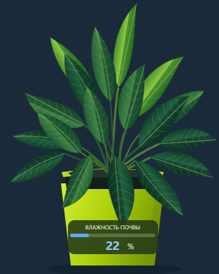

# 🌱 growbox_esp — Растишка

Прошивка умного гроубокса на **ESP32-S3** (PlatformIO + ESP-IDF): датчики, реле и веб-интерфейс «Растишка».



## Возможности

- Температура и влажность воздуха (RS485)
- Влажность почвы (два датчика ADC)
- Управление реле через TCA9554 (фитолампа, полив)
- Веб-UI из SPIFFS (`data/index.html`): статусы, автополив, режимы лампы
- HTTP API для статуса и реле

## Железо

| Параметр | Значение |
|----------|----------|
| Плата | `esp32-s3-devkitc-1` |
| Flash | 16 MB |
| PSRAM | 8 MB |
| Framework | ESP-IDF |

## Быстрый старт

```bash
# Собрать и прошить прошивку
pio run -t upload

# Залить веб-файлы в SPIFFS
pio run -t uploadfs

# Монитор
pio device monitor
```

В `platformio.ini` при необходимости поправьте `upload_port` (сейчас `COM25`).

После подключения к Wi‑Fi откройте в браузере IP устройства (пишется в лог).

## Структура

```
src/           — main, HTTP, Wi‑Fi
lib/           — ADC, I2C, RS485, TCA9554
data/          — веб-интерфейс (index.html)
docs/          — превью UI
```

## HTTP API

| Метод | Путь | Описание |
|-------|------|----------|
| `GET` | `/` | Веб-интерфейс |
| `GET` | `/api/status` | JSON: температура, влажность, почва, реле, IP |
| `POST` | `/api/relay` | `{"relay":0\|1,"state":0\|1}` |
| `POST` | `/api/relay/all` | `{"state":0\|1}` |

## Лицензия

Проект для совместной работы. См. репозиторий: https://github.com/21vek54/growbox_esp
